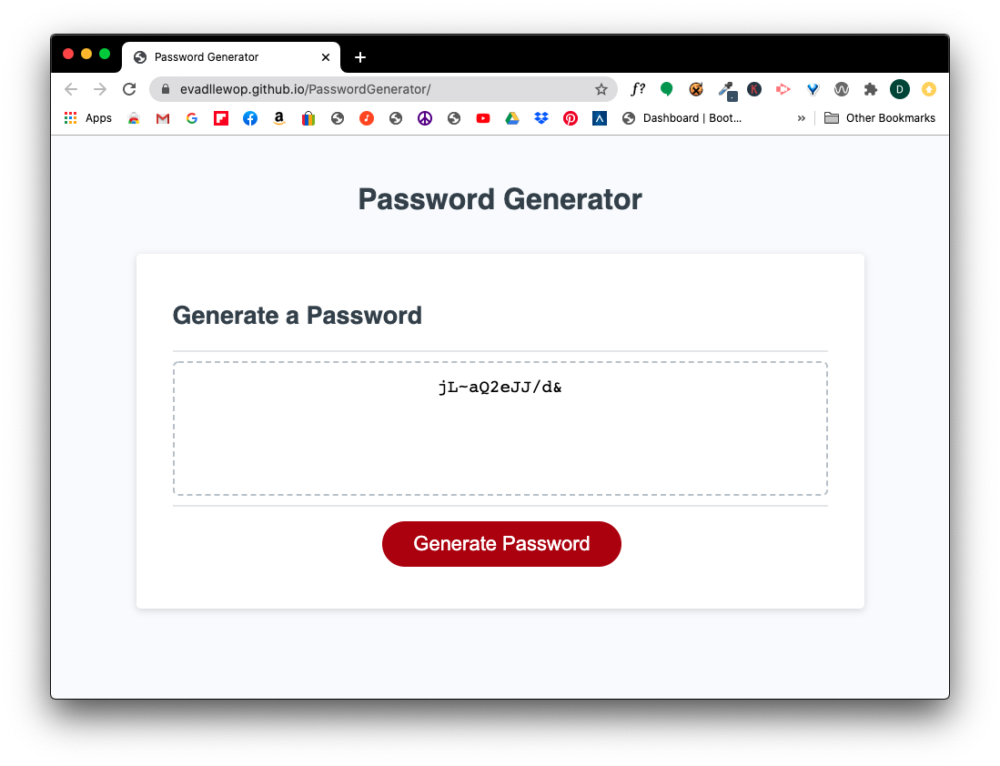

# PasswordGenerator

A random password generator built in Javascript.

This is a project that prompts the user for types of characters that they would like to have included in their password.

They can choose between:
 - Special characters
 - Numeric characters
 - Lowercase characters
 - Uppercase characters

The application then creates a random password from that criteria.

# Link to deployed application

https://evadllewop.github.io/PasswordGenerator/

# Screenshot of deployed application

